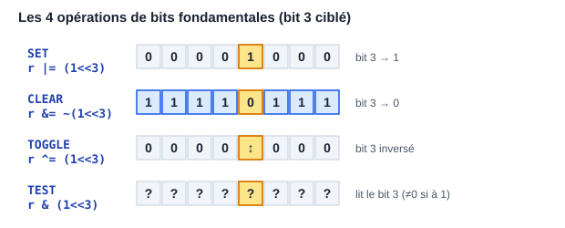
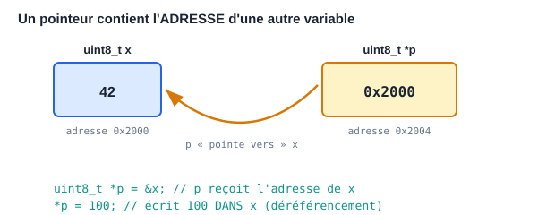
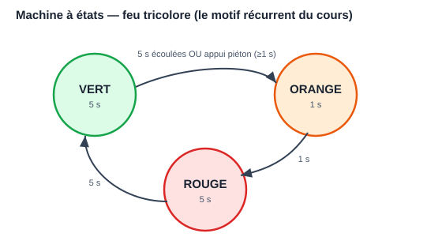

# Module 01 — Le langage C : la langue maternelle de l'embarqué

> Le C est le langage des firmwares, des drivers, des OS et des RTOS.
> Il est petit (une trentaine de mots-clés), proche du matériel, et n'a
> presque rien caché sous le capot. Le maîtriser, c'est comprendre *tout*
> le reste.

Pour pratiquer sans matériel : installe GCC (`sudo apt install build-essential`
sous Linux, MinGW/WSL sous Windows) ou utilise https://www.onlinegdb.com.

```bash
gcc main.c -o main -Wall -Wextra   # compile avec tous les avertissements
./main                              # exécute
```

---

## 1. Premier programme et structure

```c
#include <stdio.h>          // directive préprocesseur : inclut les déclarations d'E/S

int main(void) {            // point d'entrée : le programme commence ici
    printf("Bonjour\n");    // affiche du texte
    return 0;               // 0 = succès
}
```

En embarqué bare-metal, il n'y a pas de `printf` par défaut ni de retour de
`main` : le programme est une boucle infinie.

```c
int main(void) {
    init_hardware();
    while (1) {             // boucle principale — ne se termine jamais
        // lire capteurs, décider, agir
    }
}
```

---

## 2. Types et variables

### 2.1 Types de base — et pourquoi on ne les utilise pas en embarqué

`int`, `short`, `long` ont une taille **qui dépend de la machine** (un `int`
fait 16 bits sur AVR, 32 sur ARM). En embarqué on veut du précis, donc on
utilise **`<stdint.h>`** :

```c
#include <stdint.h>

uint8_t  compteur = 0;      // entier non signé 8 bits  (0 à 255)
int16_t  temperature = -40; // entier signé 16 bits     (-32768 à 32767)
uint32_t adresse = 0x40021000; // 32 bits non signé
float    tension = 3.3f;    // flottant 32 bits (coûteux sans FPU !)
```

Règles embarqué :
- Toujours la taille explicite (`uint8_t`, pas `unsigned char`).
- Éviter `float`/`double` sur les petits micros sans unité flottante :
  préférer l'arithmétique en **point fixe** (ex. stocker des millivolts en
  `int32_t` plutôt que des volts en `float`).

### 2.2 Constantes

```c
#define LED_PIN 5                      // macro préprocesseur (texte remplacé)
const uint32_t BAUDRATE = 115200;      // constante typée (préférable)
enum { MAX_CAPTEURS = 8 };             // constante entière de compilation
```

### 2.3 Portée et durée de vie

```c
uint8_t globale;              // globale : existe tout le programme, visible partout
static uint8_t privee;        // static globale : visible dans CE fichier seulement

void f(void) {
    uint8_t locale = 0;       // sur la pile, détruite à la sortie de f
    static uint8_t persistante = 0;  // conserve sa valeur entre les appels
    persistante++;
}
```

`static` a deux sens (piège d'entretien) : limiter la visibilité d'un symbole
global au fichier, ou rendre persistante une variable locale.

---

## 3. Opérateurs — dont les indispensables bit à bit

### 3.1 Classiques

`+ - * / %`, comparaisons `== != < >`, logiques `&& || !`, affectations
composées `+= -= <<=`.

**Piège n°1 du C** : `=` (affectation) vs `==` (comparaison).
`if (x = 5)` compile et est toujours vrai. Active `-Wall` !

### 3.2 Bit à bit : le pain quotidien de l'embarqué

```c
uint8_t r = 0;

r |=  (1 << 3);        // METTRE le bit 3 à 1          → 0000 1000
r &= ~(1 << 3);        // METTRE le bit 3 à 0          → 0000 0000
r ^=  (1 << 3);        // INVERSER le bit 3 (toggle)
if (r & (1 << 3)) {}   // TESTER le bit 3

uint8_t bas = octet & 0x0F;         // garder les 4 bits de poids faible (masque)
uint8_t haut = (octet >> 4) & 0x0F; // extraire les 4 bits de poids fort

uint16_t mot = ((uint16_t)hi << 8) | lo;  // assembler 2 octets en 16 bits
```



**Apprends ces cinq motifs par cœur** (set, clear, toggle, test, masque).
Ils servent dans chaque driver, chaque registre, chaque trame.

### 3.3 Décalages

`x << n` multiplie par 2ⁿ, `x >> n` divise par 2ⁿ. Décaler un signé négatif à
droite est défini par l'implémentation → faire les manipulations de bits sur
des **non signés**.

---

## 4. Contrôle de flux

```c
if (temp > 30) { ventilo_on(); }
else if (temp > 25) { ventilo_mi_vitesse(); }
else { ventilo_off(); }

switch (etat) {                 // idéal pour les machines d'états
case ETAT_REPOS:
    /* ... */
    break;                      // sans break, on TOMBE dans le cas suivant !
case ETAT_MESURE:
    /* ... */
    break;
default:
    erreur();
}

for (uint8_t i = 0; i < 8; i++) { /* 8 tours */ }
while (!(UCSR0A & (1 << UDRE0))) { }   // attendre qu'un drapeau matériel se lève
do { c = lire(); } while (c != '\n');  // au moins un tour
```

---

## 5. Fonctions

```c
// Prototype (déclaration) — dans le .h
int16_t moyenne(const int16_t *valeurs, uint8_t n);

// Définition — dans le .c
int16_t moyenne(const int16_t *valeurs, uint8_t n) {
    int32_t somme = 0;                  // 32 bits pour éviter le débordement
    for (uint8_t i = 0; i < n; i++) somme += valeurs[i];
    return (int16_t)(somme / n);
}
```

- Passage **par valeur** : la fonction reçoit une copie.
- Pour modifier une variable de l'appelant ou passer un tableau : **pointeur**.
- `const` sur un paramètre pointeur = « je promets de ne pas modifier ».

---

## 6. Les pointeurs — LE chapitre à maîtriser

Un pointeur est une variable qui contient une **adresse mémoire**.

```c
uint8_t x = 42;
uint8_t *p = &x;    // p contient l'ADRESSE de x   (& = "adresse de")
uint8_t v = *p;     // v vaut 42                    (* = "valeur pointée")
*p = 100;           // x vaut maintenant 100
```



### 6.1 Pointeurs et tableaux

```c
uint8_t tab[4] = {10, 20, 30, 40};
uint8_t *p = tab;          // un tableau "se dégrade" en pointeur sur son 1er élément
p[2]   == 30;              // vrai
*(p+2) == 30;              // strictement équivalent
```

L'**arithmétique de pointeurs** avance par *taille d'élément* : si `p` est un
`uint32_t*`, `p+1` avance de 4 octets.

### 6.2 Pointeurs vers registres matériels

Voilà pourquoi l'embarqué adore les pointeurs — accéder à une adresse fixe :

```c
#define GPIOC_ODR (*(volatile uint32_t *)0x4001100C)

GPIOC_ODR |= (1 << 13);   // écrit dans le registre de sortie du port C
```

Décomposition : `0x4001100C` est un entier → casté en « pointeur vers
`uint32_t` volatile » → déréférencé avec `*` → on obtient une lvalue qui EST
le registre.

### 6.3 Pointeurs de fonction

```c
void (*callback)(uint8_t) = NULL;      // pointeur vers fonction(uint8_t)→void

void sur_reception(uint8_t octet) { /* ... */ }

callback = sur_reception;
if (callback) callback(0x55);          // appel via le pointeur
```

Base des **callbacks**, des tables d'interruptions et des drivers génériques.

### 6.4 Les pièges mortels

```c
uint8_t *p;            // NON INITIALISÉ → pointe n'importe où
*p = 5;                // 💥 comportement indéfini

uint8_t *f(void) {
    uint8_t local = 3;
    return &local;     // 💥 adresse d'une variable détruite à la sortie
}

char buf[8];
strcpy(buf, "trop long pour huit");  // 💥 débordement de tampon
```

Réflexes : initialiser à `NULL`, tester avant usage, utiliser `snprintf` et
les versions bornées, connaître la durée de vie de ce qu'on pointe.

---

## 7. Tableaux, chaînes, structures

### 7.1 Chaînes C

Une chaîne = tableau de `char` terminé par `'\0'`.

```c
char nom[16] = "STM32";     // {'S','T','M','3','2','\0', ...}
strlen(nom);                // 5 (ne compte pas le \0)
strncpy(dst, src, sizeof dst - 1);  // copie bornée — toujours borner !
```

### 7.2 Structures

```c
typedef struct {
    uint8_t  id;
    int16_t  temperature_dixiemes;   // 253 = 25,3 °C (point fixe !)
    uint32_t horodatage;
} Mesure;

Mesure m = { .id = 1, .temperature_dixiemes = 253, .horodatage = 0 };
m.id = 2;

Mesure *pm = &m;
pm->id = 3;                 // flèche = déréférencement + accès champ
```

**Alignement/padding** : le compilateur insère des trous pour aligner les
champs. `sizeof(Mesure)` peut valoir 8 et non 7. Pour des trames réseau :
`__attribute__((packed))` (GCC) — au prix d'accès plus lents.

### 7.3 Champs de bits et unions

```c
typedef union {
    uint8_t octet;
    struct {
        uint8_t en_marche : 1;    // 1 bit
        uint8_t erreur    : 1;
        uint8_t mode      : 2;    // 2 bits
        uint8_t reserve   : 4;
    } bits;
} Statut;

Statut s = { .octet = 0 };
s.bits.mode = 2;
```

Pratique pour décoder des registres — mais l'ordre des bits dépend du
compilateur : pour du code portable, préférer masques et décalages.

---

## 8. `volatile`, `const` et qualificateurs critiques

### 8.1 `volatile` — le mot-clé de l'embarqué

Dit au compilateur : « cette variable peut changer à tout moment en dehors du
flot normal — ne mets pas sa valeur en cache, relis-la à chaque fois ».

Obligatoire pour :
1. les **registres matériels** (le matériel les modifie),
2. les variables partagées avec une **ISR**,
3. les variables partagées entre threads/tâches RTOS.

```c
volatile uint8_t drapeau_rx = 0;   // écrit par l'ISR UART

// ISR
void USART_RX_vect(void) { drapeau_rx = 1; }

// boucle principale
while (!drapeau_rx) { }   // sans volatile, le compilateur optimiserait en boucle infinie
```

⚠️ `volatile` ne rend PAS l'accès atomique. Un `uint32_t` partagé sur un CPU
8 bits se lit en 4 opérations : protéger par une section critique.

### 8.2 Lecture des déclarations complexes

```c
const uint8_t *p;        // pointeur vers un octet constant (données protégées)
uint8_t *const p;        // pointeur constant vers un octet (adresse figée)
volatile uint32_t *reg;  // pointeur vers registre volatile (le cas standard)
```

Astuce : lire de droite à gauche en partant du nom.

---

## 9. Mémoire dynamique — et pourquoi l'embarqué s'en méfie

```c
uint8_t *buf = malloc(128);
if (buf == NULL) { /* gérer l'échec ! */ }
free(buf);
buf = NULL;               // évite le "dangling pointer"
```

Problèmes en embarqué : fragmentation du tas, échec imprévisible, fuites
indétectables sur un système qui tourne des années. Règle courante
(MISRA C, code aéronautique) : **aucune allocation dynamique après
l'initialisation**. On dimensionne tout statiquement :

```c
static uint8_t tampon_rx[256];        // alloué une fois pour toutes
```

---

## 10. Préprocesseur et organisation multi-fichiers

```c
// capteur.h — l'interface publique
#ifndef CAPTEUR_H            // garde d'inclusion : évite la double inclusion
#define CAPTEUR_H
#include <stdint.h>

void capteur_init(void);
int16_t capteur_lire(void);

#endif
```

```c
// capteur.c — l'implémentation
#include "capteur.h"

static uint8_t etat_interne;   // static : invisible hors de ce fichier

void capteur_init(void) { /* ... */ }
int16_t capteur_lire(void) { /* ... */ return 0; }
```

Macros utiles et pièges :

```c
#define MIN(a, b) ((a) < (b) ? (a) : (b))   // TOUJOURS parenthéser
#ifdef DEBUG
  #define LOG(msg) uart_print(msg)
#else
  #define LOG(msg)                          // disparaît en production
#endif
```

Compilation de plusieurs fichiers : `gcc main.c capteur.c -o app`, ou mieux,
un **Makefile** (module 06).

---

## 11. Exemple complet : blink bare-metal AVR (Arduino Uno sans Arduino)

```c
#include <avr/io.h>          // définitions des registres de l'ATmega328P
#include <util/delay.h>

int main(void) {
    DDRB |= (1 << DDB5);             // PB5 (LED carte) en sortie

    while (1) {
        PORTB ^= (1 << PORTB5);      // inverser la LED
        _delay_ms(500);
    }
}
```

Compilation et flash (avec `avr-gcc` + `avrdude`) :

```bash
avr-gcc -mmcu=atmega328p -DF_CPU=16000000UL -Os blink.c -o blink.elf
avr-objcopy -O ihex blink.elf blink.hex
avrdude -c arduino -p m328p -P /dev/ttyACM0 -U flash:w:blink.hex
```

Tu viens de faire exactement ce que fait l'IDE Arduino — sans lui.

---

## 12. Machine d'états : le patron de conception n°1 de l'embarqué

Presque tout firmware est une machine d'états finis (FSM) — tu retrouveras ce
même diagramme en C++, en VHDL et en GRAFCET (modules 02, 04, 07) :



```c
typedef enum { REPOS, CHAUFFE, MAINTIEN, ERREUR } Etat;

static Etat etat = REPOS;

void fsm_tick(void) {
    switch (etat) {
    case REPOS:
        if (bouton_marche()) { chauffage_on(); etat = CHAUFFE; }
        break;
    case CHAUFFE:
        if (temperature() >= CONSIGNE) etat = MAINTIEN;
        if (temperature() > MAXI)      etat = ERREUR;
        break;
    case MAINTIEN:
        reguler();
        if (bouton_arret()) { chauffage_off(); etat = REPOS; }
        break;
    case ERREUR:
        chauffage_off();
        alarme();
        break;
    }
}
```

Tu retrouveras cette structure partout : en C, en C++, en VHDL (module 04)
et dans le GRAFCET des automates (modules 07-08). C'est le même concept.

---

## 13. Bonnes pratiques embarqué (résumé MISRA-esque)

1. Compiler avec `-Wall -Wextra -Werror` et corriger *tous* les warnings.
2. Types explicites (`stdint.h`), pas de `int` nu.
3. Pas de `malloc` après l'init ; tailles bornées partout.
4. `volatile` sur tout ce qui est partagé avec le matériel ou une ISR.
5. ISR courtes ; drapeaux plutôt que traitement.
6. Une fonction = une responsabilité, < ~50 lignes.
7. Vérifier chaque valeur de retour (surtout les E/S).
8. Pas de récursion (pile bornée), pas de boucle sans limite de temps.
9. Tester les cas limites : 0, maximum, débordement, valeur négative.

---

## Exercices

1. Écris une fonction `uint8_t inverse_bits(uint8_t x)` qui renverse l'ordre
   des bits (0b10110000 → 0b00001101).
2. Implémente un tampon circulaire (ring buffer) de 32 octets avec
   `put()`/`get()` — la structure de données de tout driver UART.
3. Écris une FSM de feu tricolore : vert 5 s → orange 1 s → rouge 5 s, avec
   un « appui piéton » qui écourte le vert.
4. Décode cette trame de 4 octets `{0xA5, id, valeur_hi, valeur_lo}` en une
   structure, en vérifiant l'octet de tête.

➡️ Suite : **[Module 02 — C++](02-cpp.md)** (les objets sans perdre le
contrôle) ou directement **[Module 03 — Arduino](03-arduino.md)** pour
pratiquer sur du vrai matériel.
