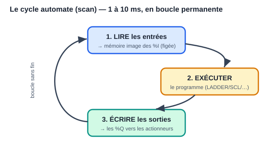
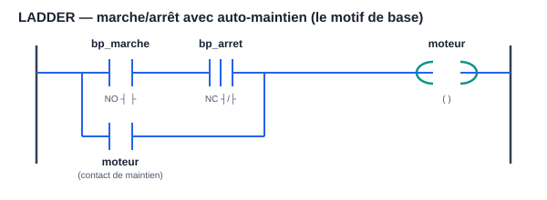
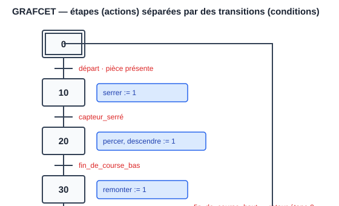

# Module 07 — Suite Siemens : TIA Portal et les automates S7

> Les **automates programmables (PLC)** sont les ordinateurs durcis qui
> pilotent usines, machines, lignes de production. Siemens (gamme **SIMATIC**)
> est le n°1 mondial. Son environnement unique s'appelle **TIA Portal**
> (Totally Integrated Automation) : programmation, configuration matérielle,
> écrans opérateurs et réseau au même endroit.

---

## 1. Le monde de l'automatisme en 10 points

1. Un PLC exécute un **cycle** permanent : *lire les entrées → exécuter le
   programme → écrire les sorties* (typiquement 1–10 ms par tour). Retiens :
   les entrées sont figées en **mémoire image** pendant tout le cycle.



2. Entrées typiques : capteurs TOR (tout-ou-rien : fins de course, cellules),
   analogiques (4–20 mA, 0–10 V), codeurs.
3. Sorties typiques : contacteurs, électrovannes, variateurs de vitesse,
   voyants.
4. Les langages sont normalisés **IEC 61131-3** : LADDER (LD), blocs
   fonctionnels (FBD), texte structuré (ST), liste d'instructions (IL,
   obsolète), SFC/GRAFCET.
5. La sûreté prime : arrêts d'urgence câblés ou en **PLC de sécurité**
   (S7 F-CPU), modes manuel/auto, gestion des défauts.
6. Réseaux : **PROFINET** (Ethernet industriel Siemens), PROFIBUS
   (historique), IO-Link (capteurs), OPC UA (vers l'informatique).
7. **HMI/SCADA** : les écrans opérateurs (Siemens : WinCC).
8. Le matériel se « câble » aussi dans le logiciel : la **configuration
   matérielle** (racks, modules, adresses) fait partie du projet.
9. Vocabulaire d'atelier : consigne, retour (feedback), verrouillage
   (interlock), front, temporisation, cadence, cycle machine.
10. On ne redémarre pas une usine « pour voir » : simulation
    (**PLCSIM**) et procédures de mise en service sont essentielles.

## 2. Le matériel SIMATIC

| Gamme | Usage | Notes |
|---|---|---|
| **LOGO!** | micro-automatisme (portail, éclairage) | programmation en blocs, très simple |
| **S7-1200** | machines petites/moyennes | LA gamme pour apprendre ; CPU 1214C classique |
| **S7-1500** | lignes de production, process | performances, diagnostic, sécurité, motion |
| ET 200SP | E/S déportées sur PROFINET | s'ajoutent aux CPU ci-dessus |
| S7-300/400 | anciennes générations | encore partout en usine (maintenance !) |

Adressage des E/S (exemples) :
- `%I0.0` : entrée TOR bit 0 de l'octet 0 — `%I` = Input.
- `%Q0.3` : sortie TOR — `%Q` = Output.
- `%IW64` : mot d'entrée analogique (16 bits).
- `%M10.0` : mémento (bit interne) ; `%MW20` : mot interne.
- `"MonDB".vitesse` : variable dans un bloc de données (voir §4).

## 3. TIA Portal : prise en main

- Versions : TIA Portal V17/V18/V19… Chaque CPU exige une version compatible.
- **Licence d'essai 21 jours** téléchargeable chez Siemens ; l'université ou
  l'employeur ont souvent des licences. Le simulateur **PLCSIM** permet de
  tout tester **sans automate**.
- Les deux vues : *Portal view* (guidée) et *Project view* (l'arbre du
  projet — celle qu'on utilise vraiment).

Créer un premier projet :
1. « Créer un projet » → « Configurer un appareil » → choisir la CPU exacte
   (ex. CPU 1214C DC/DC/DC, référence 6ES7 214-…).
2. La **vue des appareils** montre le rack : on y règle adresses IP
   (PROFINET), propriétés, et on ajoute les modules d'E/S.
3. **Table des variables API (tags)** : nommer les E/S — jamais d'adresses
   brutes dans le code :

   | Nom | Type | Adresse |
   |---|---|---|
   | `bp_marche` | Bool | %I0.0 |
   | `bp_arret` | Bool | %I0.1 |
   | `capteur_haut` | Bool | %I0.2 |
   | `moteur` | Bool | %Q0.0 |

4. Programmer dans `Main [OB1]` (voir §4), compiler, puis
   « Démarrer la simulation » (PLCSIM) ou « Charger dans l'appareil ».
5. **Table de visualisation (watch table)** : lire/forcer des variables en
   ligne — l'outil de mise au point n°1.

## 4. L'organisation d'un programme S7

Le programme est fait de **blocs** :

- **OB (Organization Block)** : appelés par le système.
  - `OB1` : le cycle principal (ton `loop()`).
  - `OB100` : au démarrage (ton `setup()`).
  - OB cycliques (`OB30+` : toutes les X ms), OB d'erreur (`OB82`…).
- **FC (Function)** : fonction **sans mémoire** — que des paramètres
  d'entrée/sortie et des variables temporaires.
- **FB (Function Block)** : fonction **avec mémoire** : chaque appel possède
  son **DB d'instance** qui conserve ses données entre les cycles.
  (FB ≈ classe, DB d'instance ≈ objet — le parallèle avec le C++ est exact.)
- **DB (Data Block)** : bloc de données global (recettes, consignes, états).

Types de données : `Bool`, `Int` (16 bits), `DInt` (32), `Real` (flottant),
`Time` (`T#2s500ms`), `String`, `Array[0..9] of Real`, `Struct` / types UDT.

⚠️ S7-1200/1500 : préférer l'**adressage symbolique** et les **DB optimisés**
(accès par nom, plus d'offsets manuels).

## 5. LADDER (CONT) : le langage des électriciens

Le LADDER transpose les schémas à relais : des « barreaux » lus de gauche à
droite, à chaque cycle, de haut en bas.

### 5.1 Marche/arrêt avec auto-maintien (LE motif de base)

```
     bp_marche      bp_arret       defaut         moteur
    ──┤ ├────────────┤/├────────────┤/├────────────( )──
      moteur    │
    ──┤ ├───────┘        (contact de maintien en parallèle du bouton)
```



- `┤ ├` contact NO (vrai si bit à 1) ; `┤/├` contact NF (vrai si bit à 0).
- `( )` bobine : écrit le résultat dans le bit.
- Lecture : le moteur démarre si `bp_marche` ET PAS `bp_arret` ET PAS
  `defaut` ; une fois parti, il **se maintient** par son propre contact.
- Équivalent : bobines `(S)`/`(R)` (Set/Reset) — attention, la dernière
  écriture du cycle gagne.

### 5.2 Fronts, temporisations, compteurs

- **Front montant** : `─┤P├─` (avec un bit de mémoire associé) — vrai un seul
  cycle. Indispensable pour compter des pièces, pas des durées d'appui.
- **Temporisations IEC** (des FB à instancier) :
  - `TON` : retard à l'enclenchement (Q passe à 1 après PT de IN vrai) ;
  - `TOF` : retard au déclenchement ; `TP` : impulsion calibrée.
- **Compteurs** : `CTU` (comptage), `CTD`, `CTUD` avec consigne `PV` et
  sortie `Q` quand atteinte.

Exemple : tapis roulant qui s'arrête 5 s après le dernier carton détecté →
un `TOF` avec `PT := T#5s` sur la cellule.

### 5.3 Comparaisons et calcul en LADDER

Boîtes `CMP >=`, `ADD`, `MOVE`, `SCALE_X`/`NORM_X` (mise à l'échelle des
analogiques : convertir `%IW64` (0..27648) en 0..100 °C).

## 6. FBD (LOG) : les blocs logiques

Même sémantique que le LADDER, dessinée en portes ET/OU/NON reliées par des
fils. Certains préfèrent FBD pour la logique combinatoire dense ; les
Allemands l'utilisent beaucoup. Sache lire les deux — le contenu (contacts,
temporisations, FB) est identique.

## 7. SCL : le texte structuré (ton avantage de développeur)

**SCL** (Structured Control Language) est le ST de l'IEC 61131-3, proche du
Pascal. Avec ton bagage C, c'est ton langage naturel pour tout ce qui est
calcul, boucles, chaînes, algorithmes.

```pascal
// FB "RegulationNiveau" — corps en SCL
IF #niveau_mesure < #consigne - #hysteresis THEN
    #pompe := TRUE;
ELSIF #niveau_mesure > #consigne + #hysteresis THEN
    #pompe := FALSE;
END_IF;

// Mise à l'échelle d'une entrée analogique 0..27648 → 0..10 m
#niveau_mesure := INT_TO_REAL(#brut) / 27648.0 * 10.0;

// Boucle sur un tableau
FOR #i := 0 TO 9 DO
    #somme := #somme + #mesures[#i];
END_FOR;
#moyenne := #somme / 10.0;

CASE #etape OF
    0: IF #bp_depart THEN #etape := 10; END_IF;
    10: #verin_sortir := TRUE;
        IF #capteur_sorti THEN #etape := 20; END_IF;
    20: // ...
END_CASE;
```

Syntaxe : `:=` affectation, `=` comparaison, `#var` variable locale du bloc,
`"MonDB".x` accès global, mots-clés `AND OR NOT XOR`, blocs terminés par
`END_IF/END_FOR/END_CASE`. Bonnes pratiques d'usine : LADDER pour les
verrouillages et la logique visible par la maintenance, **SCL pour les
calculs et les séquences complexes**.

## 8. GRAFCET / SFC : les séquences

Le **GRAFCET** (norme française devenue IEC 60848 / SFC) décrit un cycle
machine en **étapes** (actions) séparées par des **transitions**
(conditions) :

```
   ┌────────┐
   │ 0 Init │  (étape initiale)
   └───┬────┘
       ┼  bp_depart ET piece_presente        ← transition
   ┌───┴────┐
   │10 Serrer│  action : verin_serrage := 1
   └───┬────┘
       ┼  capteur_serre
   ┌───┴────┐
   │20 Percer│ actions : moteur_broche, descente
   └───┬────┘
       ┼  fin_de_course_bas
   ┌───┴────┐
   │30 Remonter│ …puis retour à l'étape 0
   └────────┘
```



Chez Siemens, l'éditeur graphique s'appelle **S7-GRAPH** (option, S7-1500).
Sans lui, on implémente le GRAFCET en SCL avec un `CASE #etape OF …` (voir
§7) ou en LADDER avec un bit par étape — sachant dessiner le GRAFCET sur
papier d'abord : c'est **l'outil de conception**, exigé dans toute étude
d'automatisme française.

## 9. HMI : WinCC

Dans TIA Portal, on ajoute un pupitre (Basic Panel KTP700, Comfort Panel, ou
**WinCC Unified**) au projet :

1. Créer les **vues** (écrans) : boutons, voyants, champs numériques,
   courbes, jauges.
2. Relier chaque objet à une **variable HMI** pointant vers une variable API
   (la liaison PROFINET est déjà dans le projet).
3. **Alarmes** : messages déclenchés sur bits/valeurs, avec accusé.
4. **Archives** : historiser des mesures, tracer des courbes.
5. Gestion des **utilisateurs** (opérateur/régleur/admin) par niveaux.
6. Simulation du pupitre sur PC intégrée (avec PLCSIM à côté : machine
   virtuelle complète sans un seul câble).

## 10. PROFINET, diagnostic et outils du quotidien

- **PROFINET** : Ethernet industriel temps réel. Chaque appareil a un nom
  d'appareil + IP ; l'échange d'E/S est cyclique et surveillé. Configuration
  dans la « vue de réseau » de TIA.
- **Diagnostic** : LED de la CPU, « en ligne et diagnostic », tampon de
  diagnostic (l'historique des défauts — premier réflexe en dépannage).
- **Comparaison en ligne/hors ligne** : voir si le programme dans l'automate
  diffère du projet.
- **Forçage** : imposer une E/S pour tester — avec les précautions d'usage.
- **TIA Openness / bibliothèques** : automatiser et standardiser les projets.

## 11. Parcours d'apprentissage Siemens

1. Installe TIA Portal (essai) + PLCSIM. Sans PC assez costaud : commence
   par un simulateur LADDER générique, mais vise TIA.
2. Refais en LADDER : marche/arrêt auto-maintenu → télérupteur (front +
   bascule) → chenillard avec TON → comptage de pièces CTU.
3. Feu tricolore en GRAFCET papier, puis en SCL (`CASE`), puis testé PLCSIM.
4. Mini-projet « station de remplissage » : convoyeur, détection bouteille,
   remplissage temporisé, compteur de lot, défauts (bourrage = cellule
   activée trop longtemps), écran WinCC avec marche/arrêt/consigne/alarme.
5. Passe les tutoriels officiels SCE (Siemens Automation Cooperates with
   Education) : gratuits, en français, excellents.
6. Certification utile en France : les titres pro / BTS CRSA-CIRA s'appuient
   massivement sur TIA Portal.

## Exercices

1. LADDER : va-et-vient d'un chariot entre deux fins de course, avec arrêt
   d'urgence prioritaire et réarmement obligatoire.
2. SCL : bloc FB `Moyenne_Glissante` (Array de 10 Real, entrée `nouvelle_mesure`,
   sortie `moyenne`) — puis instancie-le deux fois (deux capteurs).
3. GRAFCET : porte de garage (impulsion → ouvre ; obstacles → réouverture ;
   fin de course haut/bas ; temporisation de fermeture auto 30 s). Dessine,
   puis code en `CASE`.
4. HMI : écran avec bouton MARCHE, voyant état moteur, champ consigne
   vitesse, et une alarme « défaut thermique ».

➡️ Suite : **[Module 08 — Suite Schneider](08-schneider.md)** : mêmes
concepts, autre écosystème.
