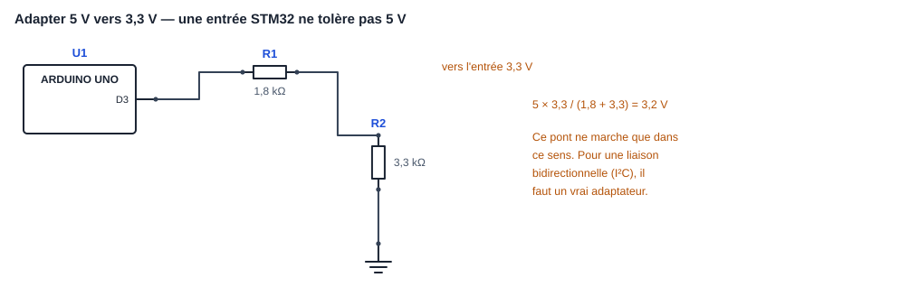
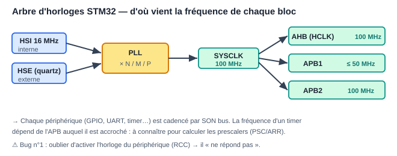
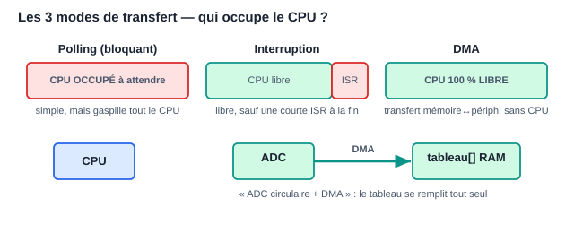

# Module 10 — STM32 : le microcontrôleur professionnel

> Le **STM32** (STMicroelectronics, cœurs ARM Cortex-M) est LE
> microcontrôleur des offres d'emploi firmware en Europe. C'est la marche
> entre Arduino et le métier : ici, c'est **toi** qui configures les
> horloges, les périphériques et les interruptions. Tout ce que les modules
> 00-02 t'ont appris (registres, pointeurs, `volatile`, ISR) devient
> quotidien.

Prérequis : modules 00, 01 (indispensables), 02 et 03 (fortement conseillés).


> 🧪 **Mini-TP associé** (15-30 min, sans matériel) : [`mini-tp/stm32/`](../mini-tp/stm32/README.md) — les calculs PSC/ARR puis un PWM à compléter.
> À faire **après la première lecture**, avant les exercices.

---

## 1. La famille STM32 et le matériel pour apprendre

### 1.1 S'y retrouver dans les références

`STM32 F4 11 RE` se décode : famille **F4** (performance), sous-famille
**11**, boîtier/flash **RE** (64 broches, 512 Ko).

| Série | Cœur | Positionnement |
|---|---|---|
| **F0 / G0** | Cortex-M0/M0+ | entrée de gamme, remplaçants des 8 bits |
| **F1** | Cortex-M3, 72 MHz | l'historique (la « Blue Pill » F103) |
| **F4** | Cortex-M4 + FPU, 100-180 MHz | LE standard d'apprentissage et d'industrie |
| **G4** | Cortex-M4 | contrôle moteur, analogique riche |
| **F7 / H7** | Cortex-M7, jusqu'à 550 MHz | haut de gamme (écran, DSP, Ethernet) |
| **L0 / L4 / U5** | Cortex-M0+/M4/M33 | **basse consommation** (piles, IoT) |
| **WB / WL** | M4 + radio | Bluetooth LE / LoRa intégrés |

### 1.2 Quelle carte acheter ?

| Carte | Prix | Avis |
|---|---|---|
| **Nucleo-F411RE** (ou F446RE) | ~15-20 € | **Le meilleur choix** : ST-Link (programmateur/débogueur) intégré, broches Arduino, alim USB |
| « Blue Pill » STM32F103C8 | ~3-5 € | Très bon marché, mais exige un ST-Link externe (~5 €) et il circule des clones défectueux |
| Discovery (F407, avec capteurs) | ~25 € | Bien aussi, plus de périphériques embarqués |

Recommandation : **une Nucleo**, rien d'autre à acheter — le débogueur est
sur la carte.

### 1.3 Ce qui change par rapport à l'Arduino Uno

| | Uno (ATmega328P) | Nucleo-F411 |
|---|---|---|
| CPU | 8 bits, 16 MHz | 32 bits ARM, 100 MHz + FPU |
| Flash / RAM | 32 Ko / 2 Ko | 512 Ko / 128 Ko |
| Tension | 5 V | **3,3 V** (⚠️ broches non tolérantes 5 V sauf indication) |
| Timers | 3 | 11, bien plus riches |
| Débogage | `Serial.print` | **points d'arrêt, pas-à-pas, inspection en direct (SWD)** |
| Config | cachée par l'IDE | horloges, broches, périphériques : à toi |

---


### Adapter les niveaux logiques

Un STM32 travaille en 3,3 V et ses entrées **ne tolèrent pas 5 V** — sauf les
broches explicitement marquées « 5 V tolerant » dans la documentation. Relier
directement une sortie Arduino à une entrée STM32 détruit la broche.



## 2. Les outils : STM32CubeIDE et CubeMX

- **STM32CubeIDE** (gratuit, Windows/Linux/Mac) : IDE Eclipse + compilateur
  `arm-none-eabi-gcc` + débogueur intégré + **CubeMX** incorporé.
- **CubeMX** : le configurateur graphique — tu cliques les broches et les
  périphériques, il **génère le code d'initialisation** en C.
- **HAL** (Hardware Abstraction Layer) : la bibliothèque C de ST
  (`HAL_GPIO_WritePin(...)`) — portable entre STM32, un peu verbeuse.
- **LL** (Low Layer) : API fine proche des registres, plus rapide.
- Alternatives pro : VS Code + extension STM32, PlatformIO, ou Makefile pur
  (CubeMX sait générer un projet Makefile).

### Créer le premier projet (blink)

1. `File → New → STM32 Project` → chercher « Nucleo-F411RE » (onglet Board
   Selector) → initialiser les périphériques par défaut : **oui**.
2. L'onglet **Pinout** s'ouvre : la LED verte est déjà sur `PA5`
   (nom `LD2`), le bouton bleu sur `PC13`.
3. `Project → Generate Code` (ou Alt+K).
4. Dans `main.c`, entre les balises `USER CODE` (⚠️ tout code hors de ces
   balises est **écrasé** à la prochaine génération) :

```c
/* USER CODE BEGIN WHILE */
while (1) {
    HAL_GPIO_TogglePin(LD2_GPIO_Port, LD2_Pin);
    HAL_Delay(500);                       // ms — s'appuie sur le timer SysTick
}
/* USER CODE END WHILE */
```

5. Clic sur le scarabée (Debug) : compilation, flash par ST-Link, arrêt sur
   `main`. **F8** pour lancer. Pose un point d'arrêt, regarde les variables
   en direct, ouvre la vue *SFRs* pour voir les **registres** du module 00
   en vrai.

---

## 3. L'arbre d'horloges (clock tree) — le passage obligé

Sur Arduino, l'horloge est réglée pour toi. Sur STM32, l'onglet **Clock
Configuration** de CubeMX montre l'arbre : source (HSI interne 16 MHz ou
HSE quartz externe) → **PLL** (multiplie) → SYSCLK → prescalers AHB/APB1/APB2
qui cadencent bus et périphériques.



À savoir :
- Tape la fréquence cible (ex. 100 MHz) dans la case HCLK : CubeMX résout la
  PLL tout seul.
- Chaque périphérique doit avoir son **horloge activée** (RCC) avant tout
  accès — CubeMX le fait dans `HAL_..._MspInit()` ; en accès registre c'est
  TON premier réflexe (`RCC->AHB1ENR |= ...`), et l'oublier est LE bug
  classique n°1 (le périphérique « ne répond pas »).
- La fréquence des timers dépend du bus APB auquel ils sont accrochés :
  toujours vérifier dans le clock tree.

---

## 4. Les périphériques essentiels avec la HAL

### 4.1 GPIO

```c
// Configuré dans CubeMX (mode Output/Input/Alternate/Analog, pull-up...)
HAL_GPIO_WritePin(GPIOA, GPIO_PIN_5, GPIO_PIN_SET);
HAL_GPIO_TogglePin(GPIOA, GPIO_PIN_5);
if (HAL_GPIO_ReadPin(GPIOC, GPIO_PIN_13) == GPIO_PIN_RESET) { /* bouton appuyé */ }
```

Interruption externe (**EXTI**) : dans CubeMX, mettre la broche en mode
`GPIO_EXTI`, activer la ligne dans l'onglet NVIC, puis :

```c
// Callback appelé par la HAL depuis l'ISR — les règles du module 00 s'appliquent
void HAL_GPIO_EXTI_Callback(uint16_t GPIO_Pin) {
    if (GPIO_Pin == B1_Pin) { drapeau_bouton = 1; }   // court : un drapeau volatile
}
```

### 4.2 UART (le `Serial` de STM32)

Sur Nucleo, l'**USART2** (PA2/PA3) passe par le ST-Link et apparaît comme un
port série USB sur le PC — ton canal de debug gratuit.

```c
char msg[] = "Bonjour STM32\r\n";
HAL_UART_Transmit(&huart2, (uint8_t*)msg, sizeof msg - 1, 100);   // bloquant, timeout 100 ms

uint8_t rx;
HAL_UART_Receive_IT(&huart2, &rx, 1);          // version par interruption
void HAL_UART_RxCpltCallback(UART_HandleTypeDef *h) {
    traiter(rx);
    HAL_UART_Receive_IT(&huart2, &rx, 1);      // réarmer !
}
```

Astuce confort : rediriger `printf` vers l'UART en implémentant
`int __io_putchar(int ch)` — cherché automatiquement par la libc de ST.

### 4.3 Timers et PWM

Exemple : PWM 1 kHz sur TIM2 canal 1 (PA0). Le timer compte à
`f_bus / (PSC+1)` et déborde à `ARR+1` ticks ; le canal compare avec `CCR`.

```
f_PWM = f_timer / ((PSC+1) × (ARR+1))
100 MHz / ((99+1) × (999+1)) = 1 kHz   → PSC=99, ARR=999
```

```c
HAL_TIM_PWM_Start(&htim2, TIM_CHANNEL_1);
__HAL_TIM_SET_COMPARE(&htim2, TIM_CHANNEL_1, 250);   // rapport cyclique 25 % (250/1000)
```

Interruption périodique (base de temps) : mode « Update event », puis

```c
HAL_TIM_Base_Start_IT(&htim3);
void HAL_TIM_PeriodElapsedCallback(TIM_HandleTypeDef *h) {
    if (h->Instance == TIM3) { tick_1ms(); }
}
```

Autres modes qui font la réputation des timers STM32 : *Input Capture*
(mesurer une largeur d'impulsion — ton HC-SR04 sans `pulseIn`), *Encoder
Mode* (lire un codeur en quadrature en matériel, zéro CPU), one-pulse,
timers synchronisés.

### 4.4 ADC

12 bits (0..4095), plusieurs canaux scannés en séquence, déclenchable par
timer.

```c
HAL_ADC_Start(&hadc1);
HAL_ADC_PollForConversion(&hadc1, 10);
uint32_t brut = HAL_ADC_GetValue(&hadc1);            // 0..4095
float volts = brut * 3.3f / 4095.0f;
```

### 4.5 I2C et SPI

```c
// I2C : lire 6 octets chez un capteur (adresse 7 bits décalée d'un cran !)
HAL_I2C_Mem_Read(&hi2c1, 0x68 << 1, 0x3B, 1, buf, 6, 100);

// SPI avec chip select manuel
HAL_GPIO_WritePin(CS_GPIO_Port, CS_Pin, GPIO_PIN_RESET);
HAL_SPI_TransmitReceive(&hspi1, tx, rx, len, 100);
HAL_GPIO_WritePin(CS_GPIO_Port, CS_Pin, GPIO_PIN_SET);
```

⚠️ Piège I2C n°1 : la HAL attend l'adresse **déjà décalée à gauche**
(`0x68 << 1`), contrairement à la bibliothèque Wire d'Arduino.

### 4.6 Les trois modes d'E/S : polling, interruption, DMA

Presque chaque fonction HAL existe en trois versions — c'est un concept
central :

| Mode | Exemple | CPU pendant le transfert |
|---|---|---|
| Bloquant | `HAL_UART_Transmit` | occupé à attendre |
| Interruption | `HAL_UART_Transmit_IT` | libre, ISR à la fin |
| **DMA** | `HAL_UART_Transmit_DMA` | **libre, zéro ISR intermédiaire** |

Le **DMA** (Direct Memory Access) copie mémoire↔périphérique sans le CPU :
indispensable pour l'ADC continu, l'audio, les gros transferts SPI/UART.
Motif star : **ADC en mode circulaire + DMA** — le tableau `mesures[]` se
remplit tout seul en tâche de fond, le programme se contente de le lire.



### 4.7 NVIC : les priorités d'interruption

Le contrôleur d'interruptions ARM (**NVIC**) donne une **priorité réglable à
chaque IRQ** (0 = la plus urgente) avec préemption imbriquée — bien plus
riche que l'AVR. Dans CubeMX : onglet NVIC. Règle pratique : les E/S rapides
(UART, DMA) plus prioritaires que les timers lents ; et si tu utilises
FreeRTOS, seules les priorités numériquement ≥
`configMAX_SYSCALL_INTERRUPT_PRIORITY` ont le droit d'appeler l'API RTOS
(`...FromISR`) — l'erreur classique de mise en route.

---

## 5. Descendre encore : la HAL vue de dessous

Pour comprendre (et pour les entretiens), refais le blink **en accès
registres direct**, sans HAL :

```c
#include "stm32f4xx.h"          // définitions CMSIS : RCC, GPIOA, structures...

int main(void) {
    RCC->AHB1ENR |= RCC_AHB1ENR_GPIOAEN;      // 1) horloge du port A — TOUJOURS d'abord
    GPIOA->MODER &= ~GPIO_MODER_MODER5;       // 2) PA5 : nettoyer les 2 bits de mode
    GPIOA->MODER |=  GPIO_MODER_MODER5_0;     //    01 = sortie

    while (1) {
        GPIOA->ODR ^= GPIO_ODR_OD5;           // 3) basculer la sortie
        for (volatile uint32_t i = 0; i < 400000; i++);   // attente grossière
    }
}
```

Tout le module 01 est là : pointeurs vers structures de registres
(`GPIOA->` est un pointeur vers une `struct` mappée à `0x40020000`), masques,
`volatile`. La documentation de référence : le **Reference Manual** (RM0383
pour le F411) — apprendre à y naviguer (chapitre RCC, chapitre GPIO, tableau
des registres) est une compétence professionnelle en soi. Le **datasheet**
donne le brochage et l'électrique ; le RM donne les registres.

---

## 6. Le débogage sérieux (l'énorme avantage du STM32)

- **Points d'arrêt / pas-à-pas / variables live** via SWD — plus jamais de
  debug à l'aveugle.
- **Live Expressions** : suivre une variable en continu pendant l'exécution.
- Vue **SFRs** : lire/écrire les registres périphériques en direct.
- **Fault Analyzer** : quand le programme part en `HardFault` (pointeur fou,
  division par zéro), il montre l'instruction et les registres au moment du
  crash — le module 01 §6.4 en pratique.
- En dehors de l'IDE : **OpenOCD + GDB** (`arm-none-eabi-gdb`) — le duo des
  chaînes CI et de Linux.
- Réflexe pro : à un plantage mystérieux, vérifier 1) horloge du
  périphérique activée, 2) taille de pile, 3) `volatile` manquant, 4)
  priorités NVIC vs FreeRTOS.

---

## 7. FreeRTOS sur STM32

CubeMX intègre FreeRTOS (via la couche **CMSIS-RTOS v2**) : coche
`Middleware → FREERTOS`, crée tes tâches dans l'interface, génère.

```c
void TacheCapteur(void *arg) {
    for (;;) {
        mesure_t m = lire_bme280();
        osMessageQueuePut(fileMesures, &m, 0, 0);
        osDelay(100);                            // 100 ms, CPU rendu au système
    }
}
void TacheLog(void *arg) {
    mesure_t m;
    for (;;) {
        if (osMessageQueueGet(fileMesures, &m, NULL, osWaitForever) == osOK)
            printf("T=%d.%d C\r\n", m.t / 10, m.t % 10);
    }
}
```

Notes STM32 : passer la base de temps HAL sur un timer dédié (CubeMX le
demande) car SysTick est pris par l'OS ; surveiller la pile de chaque tâche
(`uxTaskGetStackHighWaterMark`) ; ISR → uniquement les fonctions `FromISR`.

---

## 8. Parcours conseillé : d'Arduino au STM32 en 6 étapes

1. **Blink HAL** + bouton par interruption EXTI (avec anti-rebond logiciel).
2. **UART** : `printf` redirigé, puis réception par interruption dans un
   **ring buffer** (celui du module 01, enfin utile en vrai) — mini
   interpréteur de commandes (`led on`, `led off`).
3. **Timers** : PWM qui fait respirer la LED, puis *Input Capture* pour
   mesurer un HC-SR04, puis base de temps 1 ms qui remplace tous les délais.
4. **ADC + DMA circulaire** : 2 canaux scannés en continu, moyenne glissante,
   envoi UART toutes les 100 ms — sans une seule attente bloquante.
5. **Refaire la station météo du module 03** : BME280 en I2C, OLED en SPI,
   architecture en drivers propres (`bme280.c/.h`…) + FSM.
6. **Version FreeRTOS** de la station : tâches capteur / affichage / console,
   files et mutex. Puis, pour la culture : refaire l'étape 1 **en registres
   purs** avec le Reference Manual ouvert.

À l'issue : tu as exactement le profil « firmware junior » que demandent les
annonces (STM32, HAL, UART/I2C/SPI, DMA, FreeRTOS, debug SWD).

---

## 9. Écosystème et culture

- **CMSIS** : la couche ARM commune (définitions de registres, intrinsics,
  DSP) — c'est elle qui rend le code portable entre vendeurs.
- **Bootloader système** : tout STM32 peut se flasher par UART/USB (DFU)
  sans débogueur — broche BOOT0.
- **STM32CubeProgrammer** : outil de flash/lecture, options bytes,
  protection lecture (RDP).
- Basse conso : modes Sleep/Stop/Standby, réveil par RTC/EXTI — le domaine
  des séries L.
- Alternatives à la HAL : **libopencm3** (open source), **Zephyr** (RTOS +
  drivers, très demandé), **Rust/embassy** (module 06 §3 — le blink montré
  là-bas tourne sur STM32).
- La même démarche s'applique aux autres 32 bits : ESP-IDF (ESP32), RP2040
  SDK — qui a appris STM32+HAL s'adapte en quelques jours.

---

## Exercices

1. Chenillard 4 LED cadencé par interruption TIM3, vitesse réglée par
   potentiomètre sur ADC — zéro `HAL_Delay` dans la boucle.
2. Console UART : réception IT + ring buffer, commandes `pwm <0-100>` et
   `status`, écho des caractères.
3. Mesure de fréquence : signal carré sur une entrée *Input Capture*,
   affichage de la fréquence en UART (teste avec le PWM d'une autre broche
   rebouclée !).
4. `HardFault` volontaire : déréférence un pointeur nul, observe le Fault
   Analyzer, explique le crash.
5. Étape 6 du parcours (station météo FreeRTOS) — le projet portfolio.

➡️ Retour à l'index : **[README](../README.md)** — ou approfondis avec
**[Module 06](06-autres-langages.md)** (RTOS, Rust, Linux embarqué).
