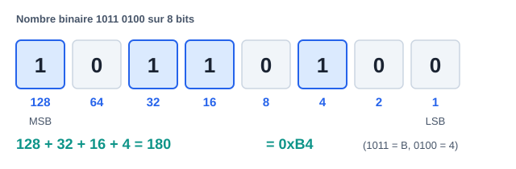

# QCM de validation par module

> Règle : fais le QCM d'un module **sans notes**, après le cours et le TD.
> Objectif : ≥ 80 % avant de passer au module suivant. Les corrigés (avec
> justification) sont en bas de page — ne triche que contre toi-même.

---

## Module 00 — Fondamentaux (10 questions)

> Aide-mémoire visuel pour les Q1-Q2 :
>
> 

**Q1.** `0x3C` vaut en décimal : a) 54 b) 60 c) 66 d) 74

**Q2.** Sur 8 bits en complément à deux, `0xFF` représente :
a) 255 b) −1 c) −127 d) −128

**Q3.** Une bascule D recopie D sur Q : a) en permanence b) quand l'horloge
est haute c) au front d'horloge d) à la mise sous tension

**Q4.** Le bus qui exige une ligne de sélection (CS) par esclave :
a) UART b) I2C c) SPI d) CAN

**Q5.** Les pull-ups sont indispensables sur : a) UART b) I2C c) SPI d) CAN

**Q6.** Une ISR doit être courte parce que :
a) la pile est petite b) elle bloque le programme principal et
potentiellement d'autres interruptions c) le compilateur l'impose
d) elle s'exécute plus lentement

**Q7.** `volatile` garantit : a) l'atomicité b) la relecture à chaque accès
c) la protection contre les ISR d) l'alignement

**Q8.** Un PWM à rapport cyclique 25 % sur une LED : a) l'allume 1 s sur 4
b) réduit sa luminosité apparente à ~25 % c) réduit sa tension à 25 %
en continu d) la fait clignoter visiblement

**Q9.** Dans la toolchain, l'éditeur de liens (linker) :
a) traduit le C en assembleur b) résout les adresses entre fichiers objets
c) flashe la puce d) supprime les commentaires

**Q10.** « Temps réel » signifie : a) très rapide b) délai de réponse
garanti c) sans OS d) multitâche

## Module 01 — C (10 questions)

**Q11.** `x |= (1 << 3);` : a) teste le bit 3 b) met le bit 3 à 1
c) met le bit 3 à 0 d) inverse le bit 3

**Q12.** `uint8_t i = 0; i--;` donne : a) −1 b) 0 c) 255 d) indéfini

**Q13.** Si `p` est un `uint32_t*`, `p + 1` avance de :
a) 1 octet b) 2 octets c) 4 octets d) 8 octets

**Q14.** Retourner l'adresse d'une variable locale est :
a) valide b) valide si static c) un comportement indéfini d) une erreur de
compilation — (deux réponses à discuter)

**Q15.** `const uint8_t *p` signifie : a) pointeur constant b) données
pointées non modifiables via p c) les deux d) rien de spécial

**Q16.** En embarqué critique, `malloc` après l'init est :
a) recommandé b) obligatoire c) proscrit (fragmentation/imprévisibilité)
d) plus rapide

**Q17.** Une variable partagée ISR/main doit être :
a) globale b) static c) volatile (et protégée si > taille atomique)
d) const

**Q18.** `#define MIN(a,b) a < b ? a : b` est dangereux car :
a) trop lent b) non parenthésé (précédence) c) interdit en C99 d) réentrant

**Q19.** `sizeof` d'une struct peut dépasser la somme de ses champs à cause :
a) du compilateur qui se trompe b) du padding d'alignement c) des pointeurs
d) de l'endianness

**Q20.** Le `break` oublié dans un `switch` : a) erreur de compilation
b) le cas suivant s'exécute aussi c) sortie du switch d) boucle infinie

## Modules 02-03 — C++ / Arduino (10 questions)

**Q21.** RAII signifie que la ressource est libérée :
a) par le GC b) par le destructeur, automatiquement c) par free()
d) à la fin du programme

**Q22.** Un destructeur virtuel est nécessaire quand :
a) toujours b) on détruit via un pointeur de classe de base c) la classe a
des templates d) jamais en embarqué

**Q23.** Le polymorphisme par templates par rapport aux fonctions virtuelles :
a) est résolu à l'exécution b) est résolu à la compilation (zéro indirection)
c) consomme plus de RAM d) est plus lent

**Q24.** Sur Arduino Uno, `int` fait : a) 8 bits b) 16 bits c) 32 bits
d) 64 bits

**Q25.** `millis() - t0 >= periode` plutôt que `millis() >= t0 + periode` :
a) plus lisible b) robuste au débordement de millis() c) plus rapide
d) identique

**Q26.** `INPUT_PULLUP` sur un bouton vers GND : appui lu comme :
a) HIGH b) LOW c) flottant d) analogique

**Q27.** Dans une ISR Arduino, `Serial.println` est :
a) conseillé pour déboguer b) interdit/dangereux c) sans effet
d) plus rapide qu'en boucle

**Q28.** `analogWrite(pin, 128)` produit : a) 2,5 V continus b) un PWM à
~50 % c) la moitié du courant d) une erreur

**Q29.** La classe `String` d'Arduino sur Uno pose problème car :
a) trop lente b) fragmentation du tas (2 Ko de RAM) c) pas de méthodes
d) non portable

**Q30.** `Led(const Led&) = delete;` sert à :
a) détruire l'objet b) interdire la copie c) économiser la flash
d) rendre la classe abstraite

## Module 04 — VHDL (8 questions)

**Q31.** Le VHDL décrit : a) des instructions séquentielles b) un circuit
dont tout fonctionne en parallèle c) un bytecode d) des scripts

**Q32.** Deux process qui écrivent le même signal :
a) le dernier gagne b) conflit « multiple drivers » c) moyenne
d) autorisé avec resolved types seulement — (b sauf std_logic résolu : à
discuter)

**Q33.** Un process combinatoire qui n'affecte pas sa sortie dans toutes les
branches crée : a) une erreur b) un latch involontaire c) une bascule
d) rien

**Q34.** `signal` vs `variable` dans un process : le signal prend sa valeur :
a) immédiatement b) à la fin du delta-cycle c) au reset d) aléatoirement

**Q35.** `wait for 10 ns` est : a) synthétisable b) simulation seulement
c) synthétisable sur Xilinx d) obligatoire

**Q36.** Une entrée asynchrone (bouton) doit passer par :
a) un pull-up b) 2 bascules de synchronisation c) un latch d) rien

**Q37.** En UART, le premier bit de données transmis est :
a) le MSB b) le LSB c) la parité d) le stop

**Q38.** `unsigned` (numeric_std) plutôt que `std_logic_vector` pour :
a) les E/S top-level b) tout ce qui compte/calcule c) les horloges
d) les resets

## Modules 07-08 — Automatismes (12 questions)

**Q39.** Le cycle automate est : a) événementiel b) lire entrées → exécuter
→ écrire sorties c) multitâche préemptif d) aléatoire

**Q40.** Un arrêt d'urgence se câble en : a) NO b) NF (sécurité positive)
c) analogique d) réseau

**Q41.** `%QW`, `%I0.3`, `%MW100` (Siemens) sont : a) sortie mot / entrée
bit / mot mémoire b) tous des bits c) tous des mots d) des DB

**Q42.** Un FB diffère d'une FC par : a) le langage b) sa mémoire propre
(DB d'instance) c) la vitesse d) rien

**Q43.** Un TON : a) retarde l'enclenchement b) retarde le déclenchement
c) compte des pièces d) génère du PWM

**Q44.** Dans un FB appelé chaque cycle, compter des appuis sans détection
de front : a) fonctionne b) compte des centaines de fois par appui
c) erreur de compilation d) plus précis

**Q45.** La logique de maintien d'un bouton HMI appartient :
a) à l'écran b) à l'automate c) au réseau d) au variateur

**Q46.** Modbus : les holding registers se lisent avec la fonction :
a) 01 b) 02 c) 03 d) 05

**Q47.** Le « mot de vie » sert à : a) compter les heures b) détecter un
automate figé malgré une liaison ouverte c) chiffrer d) synchroniser
l'horloge

**Q48.** SCL/ST : l'affectation s'écrit : a) `=` b) `:=` c) `<=` d) `==`

**Q49.** En GRAFCET, une transition est franchie si :
a) l'étape amont est active ET la réceptivité vraie b) la réceptivité est
vraie c) l'opérateur appuie d) le cycle est fini

**Q50.** Une coupure de sécurité (porte ouverte → moteur coupé) vit :
a) dans la séquence SFC b) en aval des sorties, hors séquence c) dans l'HMI
d) dans la supervision

## Module 10 — STM32 (6 questions)

**Q51.** Périphérique qui « ne répond pas » : premier réflexe :
a) changer de carte b) vérifier l'horloge RCC du périphérique
c) réinstaller CubeIDE d) baisser la fréquence

**Q52.** `f_PWM = f_timer / ((PSC+1)(ARR+1))` : pour 1 kHz à 100 MHz avec
ARR=999, PSC = : a) 9 b) 99 c) 999 d) 100

**Q53.** La HAL I2C attend l'adresse : a) 7 bits telle quelle b) décalée
d'un bit à gauche c) sur 10 bits d) en BCD

**Q54.** Le DMA sert à : a) déboguer b) transférer mémoire↔périphérique
sans CPU c) accélérer l'horloge d) protéger la flash

**Q55.** Ne pas réarmer `HAL_UART_Receive_IT` dans le callback →
a) rien b) on ne reçoit que le premier octet c) débordement
d) HardFault

**Q56.** `BFAR` après un BusFault contient : a) le code d'erreur
b) l'adresse mémoire fautive c) la ligne de code d) le numéro de tâche

---
---

## Corrigé (avec justifications brèves)

| Q | Rép. | Justification |
|---|---|---|
| 1 | b | 3×16+12=60 |
| 2 | b | tous bits à 1 = −1 en complément à 2 |
| 3 | c | bascule D = échantillonnage au front |
| 4 | c | SPI : un CS par esclave ; I2C adresse, UART point à point |
| 5 | b | I2C est à drain ouvert : sans pull-up, pas de niveau haut |
| 6 | b | elle préempte tout ; longue = latences et pertes d'événements |
| 7 | b | volatile = pas de mise en cache ; PAS d'atomicité (Q17) |
| 8 | b | puissance moyenne ; à quelques kHz l'œil intègre |
| 9 | b | le linker fixe les adresses et lie les .o |
| 10 | b | garantie d'échéance, pas vitesse |
| 11 | b | OR avec un masque = mise à 1 |
| 12 | c | non signé : arithmétique modulo 256 |
| 13 | c | arithmétique de pointeur en unités d'élément (4 octets) |
| 14 | c | l'objet est détruit ; (b) rend l'adresse valide mais change la sémantique |
| 15 | b | lire de droite à gauche : pointeur vers const uint8_t |
| 16 | c | fragmentation + échec imprévisible (MISRA) |
| 17 | c | et section critique si multi-octets sur petit CPU |
| 18 | b | `MIN(x,y)+1` etc. se parenthèse mal ; toujours ((a)<(b)?(a):(b)) |
| 19 | b | alignement des champs |
| 20 | b | fallthrough silencieux |
| 21 | b | destructeur appelé à la sortie de portée, même sur return anticipé |
| 22 | b | sinon le destructeur dérivé n'est pas appelé (fuite/UB) |
| 23 | b | monomorphisation à la compilation |
| 24 | b | AVR 8 bits : int = 16 bits |
| 25 | b | la soustraction non signée absorbe le wrap de 49 j |
| 26 | b | pull-up interne : repos=HIGH, appui=LOW |
| 27 | b | Serial utilise des IRQ/tampons : blocage possible |
| 28 | b | 128/255 ≈ 50 % de rapport cyclique |
| 29 | b | allocations dynamiques répétées dans 2 Ko |
| 30 | b | interdit la copie (ex. objet RAII, driver) |
| 31 | b | description matérielle, parallélisme intrinsèque |
| 32 | b | multiple drivers = erreur (sauf tri-state voulu avec 'Z') |
| 33 | b | il faut mémoriser → latch inféré |
| 34 | b | c'est ce qui modélise la bascule |
| 35 | b | le temps n'existe pas en synthèse |
| 36 | b | synchroniseur anti-métastabilité |
| 37 | b | LSB first |
| 38 | b | unsigned sait compter ; slv pour les interfaces neutres |
| 39 | b | cycle scan, mémoire image |
| 40 | b | fil coupé = déclenchement (sécurité positive) |
| 41 | a | Q=sortie, I=entrée, M=mémento ; W=mot, x.y=bit |
| 42 | b | FB + DB d'instance ≈ classe + objet |
| 43 | a | Timer ON delay |
| 44 | b | le FB tourne à chaque cycle (~ms) |
| 45 | b | liaison HMI perdue ≠ ordre bloqué ; l'automate décide |
| 46 | c | FC03 read holding ; 01=coils, 05=write coil |
| 47 | b | compteur qui doit bouger : liaison OK ≠ programme vivant |
| 48 | b | `=` est la comparaison en ST |
| 49 | a | les deux conditions, toujours |
| 50 | b | une séquence peut rester bloquée ; la sécurité est transversale |
| 51 | b | RCC : l'oubli n°1 |
| 52 | b | 100e6/((99+1)(999+1)) = 1 kHz |
| 53 | b | adresse 7 bits << 1 |
| 54 | b | définition du DMA |
| 55 | b | l'IT one-shot doit être réarmée |
| 56 | b | Bus Fault Address Register |

### Barème indicatif par module

00 : Q1-10 · 01 : Q11-20 · 02/03 : Q21-30 · 04 : Q31-38 · 07/08 : Q39-50 ·
10 : Q51-56. **Un module est validé à 80 %** (ex. 8/10). En dessous :
relire la section du cours correspondant à chaque erreur (le corrigé te
donne le mot-clé), refaire le TD, retenter à 48 h.
