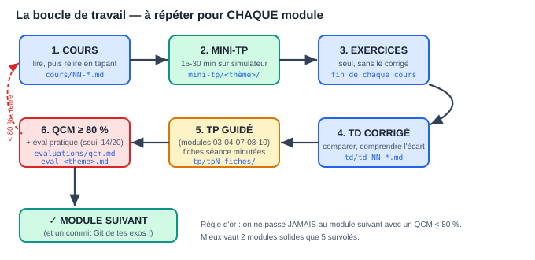

# Parcours type — par où commencer et comment travailler

> **Ce document est ton point d'entrée.** Il répond aux trois questions du
> premier jour : dans quel ordre lire ? quel fichier ouvrir à chaque
> étape ? comment savoir si je peux passer à la suite ? Imprime la
> checklist de la dernière page et coche au fil de l'eau.

---

## Tes 30 premières minutes (aujourd'hui)

1. **☐ Mets ces 3 sites en favoris** — ils couvrent 80 % de la formation
   sans rien installer :
   - https://wokwi.com (Arduino/ESP32 simulés, avec breadboard)
   - https://www.onlinegdb.com (C, C++, Java en ligne)
   - https://www.edaplayground.com (VHDL + chronogrammes)
2. **☐ Fais ton premier mini-TP tout de suite** : ouvre
   `mini-tp/c/bits_a_trous.c`, colle-le dans OnlineGDB, complète les 4
   trous. En 20 min tu sauras si les bases de bits sont acquises — et tu
   auras compris le format de toute la formation.
3. **☐ Crée ton dépôt GitHub personnel** (`formation-embarque-exos`) : tu y
   committeras chaque exercice. C'est ton futur portfolio — il commence
   aujourd'hui, pas « quand je serai bon ».

---

## La boucle de travail (le cœur de la méthode)



Chaque module se travaille avec la même boucle en 6 temps :

| # | Étape | Fichier à ouvrir | Durée typique |
|---|---|---|---|
| 1 | **Cours** — lire une fois en entier, puis relire en tapant chaque exemple | `cours/NN-….md` (ou `pdf/1-cours/`) | 2-6 h |
| 2 | **Mini-TP** — programme à trous sur simulateur, auto-vérifiant | `mini-tp/<thème>/README.md` | 15-30 min |
| 3 | **Exercices du cours** — seul, sans corrigé, dans TON dépôt Git | fin du fichier de cours | 2-4 h |
| 4 | **TD corrigé** — confronter, comprendre chaque écart | `td/td-NN-….md` | 1-2 h |
| 5 | **TP** (modules 03, 04, 07, 08, 10) — le projet guidé | `tp/…` + fiches `tp/tpN-fiches/` | 8-12 h |
| 6 | **Validation** — QCM ≥ 80 %, puis épreuve pratique si le thème en a | `evaluations/qcm.md` puis `eval-<thème>.md` | 0,5-3 h |

**Deux règles non négociables** :
- QCM < 80 % → on **ne passe pas** au module suivant. Le corrigé du QCM
  donne le mot-clé de la section à relire : relis, refais le TD, retente
  à 48 h.
- Chaque exercice fini = un **commit Git**. Un exercice non commité
  n'existe pas.

---

## Le parcours semaine par semaine (~6 h/semaine)

Coche au fur et à mesure. Les semaines sont indicatives : mieux vaut 2
semaines de plus qu'un module survolé.

### Phase 1 — Fondations (semaines 1 à 8)

| Sem. | À faire | Fichiers |
|---|---|---|
| 1 | ☐ Cours 00 §1-4 + TD 00 | `cours/00`, `td/td-00` |
| 2 | ☐ Cours 00 fin + QCM 00 ☐ Cours 01 §1-5 | `evaluations/qcm.md` |
| 3 | ☐ Cours 01 §6-9 (pointeurs !) + mini-TP C (les 2) | `mini-tp/c/` |
| 4 | ☐ TD 01 complet + QCM 01 ☐ compiler `code/c/` (`make test`) | `td/td-01`, `code/c/` |
| 5 | ☐ Cours 02 + mini-TP C++ + TD 02 + QCM | `mini-tp/cpp/` |
| 6 | ☐ Cours 03 + mini-TP Arduino sur Wokwi + TD 03 | `mini-tp/arduino/` |
| 7 | ☐ **TP 1 séances 1-2** (fiches minutées) | `tp/tp1-fiches/seance-1.md`, `-2` |
| 8 | ☐ **TP 1 séances 3-4** + grille /20 + QCM 03 ☐ **éval Arduino** | `evaluations/eval-arduino.md` |

**Jalon de phase** : la station météo publie en MQTT, ton dépôt Git a
≥ 15 commits. Sinon, ne pas ouvrir la phase 2.

### Phase 2 — Matériel (semaines 9 à 14)

| Sem. | À faire | Fichiers |
|---|---|---|
| 9 | ☐ Cours 04 §1-4 + mini-TP VHDL (EDA Playground) | `mini-tp/vhdl/` |
| 10 | ☐ Cours 04 fin + TD 04 ex. 1-3 + QCM 04 | `td/td-04` |
| 11 | ☐ **TP 2 séances 1-2** (émetteur + récepteur UART) | `tp/tp2-fiches/` |
| 12 | ☐ **TP 2 séance 3** + **éval VHDL** | `evaluations/eval-vhdl.md` |
| 13 | ☐ Cours 05 + mini-TP Java + TD 05 + QCM | `mini-tp/java/` |
| 14 | ☐ Cours 06 (Make, RTOS, survol) + TD 06 ☐ éval Java si visée | `evaluations/eval-java.md` |

### Phase 3 — Industrie (semaines 15 à 22)

| Sem. | À faire | Fichiers |
|---|---|---|
| 15 | ☐ Installer TIA Portal essai ☐ Cours 07 §1-6 | |
| 16 | ☐ Cours 07 fin + mini-TP Siemens (hystérésis PLCSIM) + TD 07 | `mini-tp/siemens/` |
| 17 | ☐ **TP 3 séances 1-2** (analyse PUIS programme) | `tp/tp3-fiches/` |
| 18 | ☐ **TP 3 séances 3-4** (PLCSIM + HMI) + QCM 07-08 | |
| 19 | ☐ Cours 08 + mini-TP Schneider + TD 08 | `mini-tp/schneider/` |
| 20 | ☐ **TP 4 complet** (cuve + Modbus) | `tp/tp4-fiches/` |
| 21 | ☐ **éval Siemens** OU **éval Schneider** (au choix selon ta cible) | `evaluations/eval-siemens.md` / `-schneider.md` |
| 22 | ☐ Marge de rattrapage (il en faut toujours une) | |

### Phase 4 — Professionnalisation (semaines 23 à 30)

| Sem. | À faire | Fichiers |
|---|---|---|
| 23 | ☐ Cours 10 §1-4 + mini-TP STM32 (calculs + PWM) | `mini-tp/stm32/` |
| 24 | ☐ Cours 10 fin + TD 10 + QCM 10 | `td/td-10` |
| 25-26 | ☐ **TP 5 séances 1-4** (driver maison, DMA, FreeRTOS) | `tp/tp5-fiches/` |
| 27 | ☐ **éval STM32** ☐ relire cours 09 (parcours emploi) | `evaluations/eval-stm32.md` |
| 28-30 | ☐ **PROJET FINAL** (un des 3 sujets, 30-40 h, seuil 70/100) | `evaluations/projets-notes.md` |

**Jalon final** : le projet publié sur GitHub avec son barème rempli et
des preuves — c'est ta pièce maîtresse en entretien.

---

## Où trouver quoi (carte du dépôt)

| Tu cherches… | Va dans… |
|---|---|
| La théorie d'un sujet | `cours/` (ou `pdf/1-cours/`) |
| Un test rapide de 20 min sans matériel | `mini-tp/` |
| Les liens des simulateurs | `mini-tp/README.md` |
| La correction d'un exercice | `td/` puis le code réel dans `code/` |
| Un projet guidé pas à pas | `tp/tpN-fiches/` |
| Te tester | `evaluations/` (QCM → eval-thème → projets) |
| Quel matériel acheter, quelles ressources | `cours/09-parcours-et-ressources.md` |
| Tout lire d'une traite en PDF | `pdf/0-recueils/` |
| Animer la formation pour d'autres | `guide-formateur.md` |

## Les 5 erreurs qui font abandonner (et leur antidote)

1. **Lire sans taper** → antidote : le mini-TP obligatoire avant le TD.
2. **Sauter le C** pour aller « au concret » → tu plafonneras au module 03 ;
   le C EST le concret.
3. **Regarder le corrigé trop tôt** → règle des 15 minutes : on ne l'ouvre
   qu'après 15 min de blocage réel, et on le RETAPE, jamais copié-collé.
4. **Enchaîner les modules sans valider** → les 80 % au QCM ne sont pas une
   formalité : c'est le garde-fou contre l'illusion de compréhension.
5. **Travailler sans Git** → sans trace, pas de progrès visible, pas de
   portfolio, motivation qui s'évapore. Un commit par session, minimum.

---

## Checklist globale à imprimer

```
PHASE 1  ☐ QCM 00 ≥80%   ☐ QCM 01   ☐ QCM 02/03   ☐ TP1 ≥14/20   ☐ éval Arduino
PHASE 2  ☐ QCM 04        ☐ TP2 ≥14/20   ☐ éval VHDL   ☐ QCM 05 (+éval Java)
PHASE 3  ☐ QCM 07-08     ☐ TP3 ≥14/20   ☐ TP4 ≥14/20  ☐ éval Siemens/Schneider
PHASE 4  ☐ QCM 10        ☐ TP5 ≥14/20   ☐ éval STM32  ☐ PROJET FINAL ≥70/100
GIT      ☐ dépôt créé    ☐ ≥15 commits phase 1   ☐ ≥40 commits au total
```

Bonne route — et souviens-toi de la devise de la formation : **construire
des petits projets qui marchent, souvent.**
