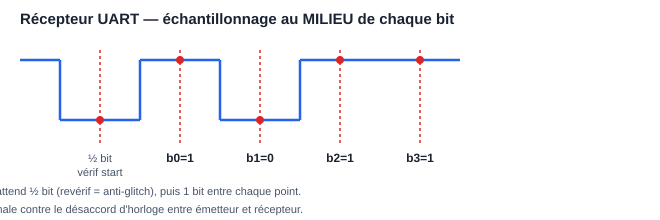

# TP 2 — Fiche de séance 2 : le récepteur UART (3 h)

## En-tête pédagogique

| | |
|---|---|
| **Objectifs** | Synchroniser une entrée asynchrone ; sur-échantillonner ; échantillonner au milieu du bit ; valider par test en boucle exhaustif |
| **Prérequis** | Séance 1 : `uart_tx` validé au chronogramme |
| **Outils** | GHDL + GTKWave |
| **Livrable** | `uart_rx.vhd` + `tb_uart_boucle.vhd` affichant « BOUCLE OK, 256/256 octets » |

## Déroulé minuté

### 0:00-0:30 — Comprendre le problème (schéma avant code)

Le récepteur n'a **pas** l'horloge de l'émetteur. Il doit :
1. Détecter le front descendant du start (la ligne au repos est à 1).
2. Attendre **½ bit** et revérifier : toujours à 0 ? → vrai start ; sinon
   c'était un parasite (filtre anti-glitch **gratuit**).
3. Ensuite, attendre **1 bit** entre chaque échantillon → on tombe pile au
   milieu de chaque bit de donnée, là où le signal est le plus stable.

Dessine ce chronogramme dans ton journal :

```
RX  ──┐start┌─b0─┐b1──┐ ...
      └─────┘    └────┘
       ▲    ▲     ▲
      ½bit +1bit +1bit    ← instants d'échantillonnage (milieu de bit)
```



Pourquoi le milieu et pas le bord ? Aux bords, le signal transitionne
(temps de montée, désynchronisation résiduelle) : c'est là qu'on se trompe.
Au milieu, on a la marge maximale de part et d'autre.

### 0:30-0:45 — Le synchroniseur : non négociable

Toute entrée asynchrone (`rx` vient d'un autre domaine d'horloge) passe par
**2 bascules en série** avant utilisation :

```vhdl
sync0 <= rx;      -- peut être métastable un court instant
sync1 <= sync0;   -- stabilisé : on n'utilise QUE sync1 ensuite
```

Sans ça, un changement de `rx` pile sur le front d'horloge peut mettre une
bascule dans un état intermédiaire (métastabilité) qui se propage et
corrompt toute la FSM. C'est LE réflexe qu'un correcteur d'entretien
vérifie en premier.

### 0:45-1:45 — Coder `uart_rx`

FSM 4 états : REPOS → VERIF_START → DONNEES → STOP. Pars du squelette du
TP principal (§2.2) et complète DONNEES et STOP. Points de vigilance :

- Dans DONNEES : à chaque fois que `cpt = TPB - 1`, échantillonner
  `shreg(idx) <= sync1` (LSB d'abord), puis incrémenter `idx` ou passer à
  STOP après le bit 7.
- Dans STOP : au milieu du bit de stop, si `sync1 = '1'` → trame valide :
  `donnee <= shreg; valide <= '1'`. Sinon (stop à 0 = erreur de trame),
  jeter silencieusement et revenir à REPOS.
- `valide` est une **impulsion d'un cycle** : mets `valide <= '0';` en
  tête de process (valeur par défaut), ne le lève que dans STOP.

Corrigé complet de référence :
[`code/vhdl/uart_rx.vhd`](../../code/vhdl/uart_rx.vhd) — mais essaie
sérieusement avant de l'ouvrir.

### 1:45-2:30 — Le testbench en boucle : le juge de paix

Le test le plus élégant : brancher TX → RX et vérifier que ce qui sort
égale ce qui entre, **pour les 256 octets possibles**. Copie
[`code/vhdl/tb_uart_boucle.vhd`](../../code/vhdl/tb_uart_boucle.vhd) ou
réécris-le : une boucle `for i in 0 to 255`, envoi, `wait until valide`,
`assert d_out = d_in severity failure`.

```bash
ghdl -a --std=08 uart_tx.vhd uart_rx.vhd tb_uart_boucle.vhd
ghdl -e --std=08 tb_uart_boucle
ghdl -r --std=08 tb_uart_boucle --stop-time=100ms
```

**✅ Point de contrôle** : la console affiche
`tb_uart_boucle : BOUCLE OK, 256/256 octets`. (C'est exactement le
résultat obtenu et vérifié dans ce dépôt.)

### 2:30-2:55 — Déboguer un échec (si besoin)

Si un octet précis échoue (`assert failure` avec le numéro) : relance en
générant les ondes et zoome sur cet octet.

```bash
ghdl -r --std=08 tb_uart_boucle --wave=rx.ghw --stop-time=100ms
gtkwave rx.ghw
```

Ajoute `etat`, `cpt`, `idx`, `shreg`, `sync1`. 90 % des bugs sont un
`cpt = TPB` au lieu de `TPB - 1` (échantillonnage un cycle trop tard, qui
dérive et rate le dernier bit). Regarde si l'instant d'échantillonnage
glisse vers le bord du bit au fil des 8 bits.

### 2:55-3:00 — Commit

```bash
git add . && git commit -m "TP2 seance 2 : uart_rx, boucle 256/256 verte"
```

## Erreurs fréquentes

| Symptôme | Cause | Remède |
|---|---|---|
| ~1 octet sur 2 faux | pas de synchroniseur, ou échantillonnage au bord | 2 bascules + échantillonner au milieu |
| Le dernier bit (b7) toujours faux | dérive « off by one » du compteur | `cpt = TPB - 1`, pas `TPB` |
| `valide` reste à 1 | pas de valeur par défaut en tête de process | `valide <= '0';` avant le case |
| Reçoit un octet décalé (bits inversés) | MSB d'abord au lieu de LSB | `shreg(idx)` avec idx croissant de 0 |
| Boucle infinie en simu | `wait until valide='1'` mais valide ne monte jamais | vérifier la logique de STOP |

## Travail à la maison (45 min)

Ajoute une sortie `erreur_trame : std_logic` (impulsion) levée quand le bit
de stop vaut 0. Fabrique un stimulus qui envoie une trame corrompue (force
`fil <= '0'` au moment du stop) et vérifie que `erreur_trame` se lève et
que `valide` **ne** se lève **pas**.

➡️ Fiche suivante : **[Séance 3 — Robustesse et intégration](seance-3.md)**
